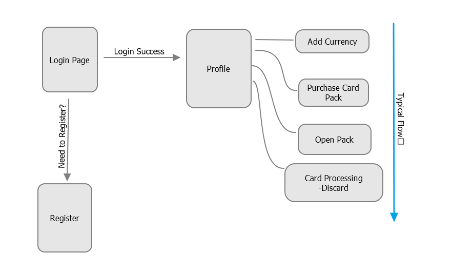
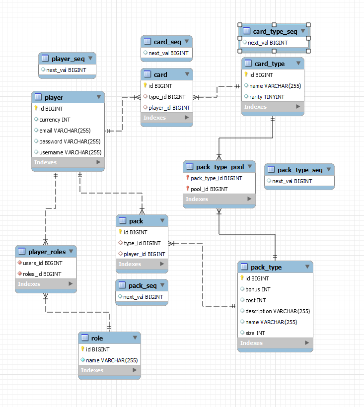

# CAP 312 - Java Developer Capstone Project

This project serves as a Capstone for the course.  The **CardCollectors** project is Gacha simulator where a registered `Player` can open card packs, expanding their collection and hoping to pull some coveted SSR cards.

## Setup

### Requirements

* Java 11+
* Java enabled IDE (IntelliJ, Eclipse, etc.)
* MySQL DB Server
* Postman

Other methods for building Spring Boot applications should suffice.

After the Spring Application is running on the localhost, use the following API calls in Postman:

1. POST: `localhost:8080/api/cards/initiate`
1. POST: `localhost:8080/api/packs/initiate`

This will initialize the database with predefined `CardType` and `PackType` objects.

One can also use `/create` API for additional `CardType` and `PackType`.

* POST: `localhost:8080/api/cards/create`
  
  ```json
  {
    "name": "cardName"
    "rarity": "SSR"
  }
  ```

* POST: `localhost:8080/api/packs/create`

  ```json
  {
    "name": "packName"
  }
  ```

Other API calls:

* GET: `localhost:8080/api/cards/all`
* GET: `localhost:8080/api/cards/draw`
* GET: `localhost:8080/api/cards/drawLimited`
* GET: `localhost:8080/api/packs/all`
* POST: `localhost:8080/api/packs/open/{packName}`

## User Experience

Once the application is running and the database is initialized, got to `localhost:8080/` in any browser.



## Technologies Used

* Spring Web
* Spring Data JPA
* Spring Security
* Thymeleaf
* MySQL

### Data Structure


